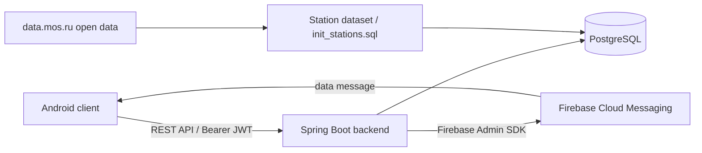
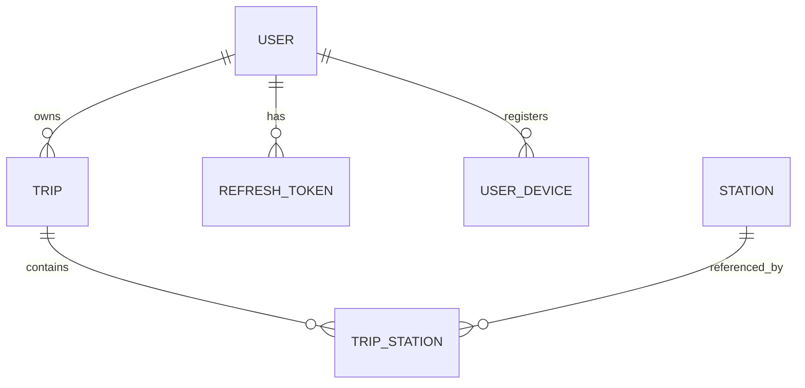

# StationTracker

StationTracker is a Spring Boot backend for a mobile metro trip-tracking application. It manages users, authentication, trip lifecycle and history, station data, mobile device registration, and Firebase Cloud Messaging events used by the Android client.

The repository focuses on the backend side of the project. The Android application acts as the client and can be distributed separately as a prebuilt APK, for example through GitHub Releases.

## Architecture



The backend is stateless from the HTTP-session perspective. Authentication is based on short-lived access JWTs and rotating opaque refresh tokens. The authenticated user ID is taken from the JWT rather than accepted from request payloads.

## Main features

- User registration and login.
- HS256 JWT access tokens.
- Opaque refresh tokens with SHA-256 hashes stored in PostgreSQL.
- Refresh-token rotation and revocation.
- Password hashing through Spring Security `PasswordEncoder`.
- Creation of ordered metro trips.
- Trip lifecycle: `CREATED -> ACTIVE -> COMPLETED` and cancellation from `CREATED` or `ACTIVE`.
- At most one unfinished (`CREATED` or `ACTIVE`) trip is expected per user by the application logic.
- Retrieval of the current unfinished trip.
- Paginated trip history for completed and cancelled trips.
- Per-station notification state with idempotent marking.
- Mobile device registration by Firebase Installation ID.
- FCM `TRIP_STARTED` data messages after the trip-start transaction commits.
- User account update and deletion.
- OpenAPI / Swagger UI documentation.
- Docker Compose environment with PostgreSQL.
- Unit tests for domain and authentication logic.

## Tech stack

| Area | Technology |
| --- | --- |
| Language | Java 21 |
| Framework | Spring Boot 4.1.1 |
| Web | Spring Web MVC |
| Security | Spring Security, OAuth2 Resource Server |
| Authentication | JWT (HS256) + rotating opaque refresh tokens |
| Persistence | Spring Data JPA / Hibernate |
| Database | PostgreSQL |
| Push notifications | Firebase Admin SDK 9.11.0 |
| API documentation | springdoc-openapi 3.1.0 / Swagger UI |
| Validation | Jakarta Bean Validation |
| Build | Maven |
| Containers | Docker / Docker Compose |
| Testing | JUnit Jupiter, Mockito, AssertJ |

## Domain model



A `TripStation` is an association entity rather than a plain many-to-many relation because every selected station has trip-specific state such as its position in the route and whether the user has already been notified about it.

### Trip lifecycle

```text
CREATED --------> ACTIVE --------> COMPLETED
   |                 |
   +-----> CANCELLED <-----+
```

## API overview

All endpoints except registration, login, refresh, and Swagger/OpenAPI resources require an `Authorization: Bearer <access-token>` header.

| Method | Endpoint | Description |
| --- | --- | --- |
| `POST` | `/auth/register` | Register a new user and issue access/refresh tokens |
| `POST` | `/auth/login` | Authenticate and issue access/refresh tokens |
| `POST` | `/auth/refresh` | Rotate a refresh token and issue a new token pair |
| `GET` | `/trips/current` | Get the current `ACTIVE` or `CREATED` trip |
| `POST` | `/trips` | Create a trip from an ordered list of station IDs |
| `GET` | `/trips/{tripId}` | Get one trip owned by the authenticated user |
| `PATCH` | `/trips/{tripId}/start` | Start a `CREATED` trip |
| `PATCH` | `/trips/{tripId}/finish` | Finish an `ACTIVE` trip |
| `PATCH` | `/trips/{tripId}/cancel` | Cancel a `CREATED` or `ACTIVE` trip |
| `PATCH` | `/trips/{tripId}/stations/{tripStationId}` | Mark a trip station as notified |
| `GET` | `/trips/history?page=0&size=10` | Get paginated completed/cancelled trip history |
| `DELETE` | `/trips/history/{tripId}` | Delete one terminal trip from history |
| `DELETE` | `/trips/history` | Clear completed/cancelled trip history |
| `PUT` | `/devices` | Register a Firebase Installation ID for the current user |
| `PUT` | `/users/update` | Update the authenticated user's login/password |
| `DELETE` | `/users` | Delete the authenticated user's account |

The complete interactive specification is available through Swagger UI when the application is running.

## Authentication design

Access tokens are signed with HS256 and contain:

- issuer: `station-tracker`;
- subject: user login;
- `userId` custom claim;
- issued-at and expiration timestamps.

The configured access-token lifetime is currently one hour (`PT1H`).

Refresh tokens are generated from 32 cryptographically secure random bytes. Only a SHA-256 hash is persisted in the database. When a refresh token is successfully used, the old token is revoked and a new refresh token is generated.

## Station data

The station catalog is derived from the Moscow Open Data Portal dataset:

**Moscow Metro station entrance/exit data:**  
https://data.mos.ru/opendata/624

The project contains a processed station dataset and `init_stations.sql`. The SQL script currently initializes 305 station/line records with prepared WGS84 coordinates. The coordinates in the processed dataset represent station-level coordinates prepared from the source entrance data for use by StationTracker.

## Configuration

Create a `.env` file in the project root:

```properties
POSTGRES_DB=stationtracker
POSTGRES_USER=stationtracker
POSTGRES_PASSWORD=change_me
JWT_SECRET=<base64-encoded-secret-at-least-256-bits>
```

A suitable JWT secret can be generated with:

```bash
openssl rand -base64 32
```

Never commit `.env`, Firebase service-account credentials, private signing keys, or other secrets.

## Firebase credentials

The backend uses the Firebase Admin SDK and requires a Firebase service-account JSON file.

Create a local directory:

```text
secrets/
└── firebase-service-account.json
```

Then point the `firebase_credentials` secret in `compose.yml` to that file:

```yaml
secrets:
  firebase_credentials:
    file: ./secrets/firebase-service-account.json
```

The backend container receives the file as a read-only Docker secret and uses:

```text
GOOGLE_APPLICATION_CREDENTIALS=/run/secrets/firebase_credentials
```

The Firebase service-account JSON must never be copied into the Docker image or committed to Git.

## Running with Docker Compose

### Requirements

- Docker Desktop or Docker Engine with Compose support.
- A valid Firebase service-account JSON file.
- A configured `.env` file.

Start the complete environment:

```bash
docker compose up -d --build
```

Check container status:

```bash
docker compose ps
```

Follow backend logs:

```bash
docker compose logs -f backend
```

Stop the environment:

```bash
docker compose down
```

Remove containers together with the PostgreSQL volume and initialize the database from scratch on the next start:

```bash
docker compose down -v
```

> `docker compose down -v` permanently removes the local PostgreSQL data volume.

### Docker services

- Backend: `http://localhost:8080`
- PostgreSQL from the host: `localhost:5433`
- PostgreSQL from the backend container: `postgres:5432`

`init_stations.sql` is mounted into PostgreSQL's `/docker-entrypoint-initdb.d/` directory and is executed when a new PostgreSQL data volume is initialized.

## Running locally without Docker

Start a PostgreSQL instance on port `5433` and provide the variables from `.env`.

Firebase also requires `GOOGLE_APPLICATION_CREDENTIALS` to point to the local service-account JSON.

Linux/macOS example:

```bash
export GOOGLE_APPLICATION_CREDENTIALS=/absolute/path/to/firebase-service-account.json
./mvnw spring-boot:run
```

Windows PowerShell example:

```powershell
$env:GOOGLE_APPLICATION_CREDENTIALS="C:\path\to\firebase-service-account.json"
.\mvnw.cmd spring-boot:run
```

## Swagger / OpenAPI

After the backend starts, open:

```text
http://localhost:8080/swagger-ui/index.html
```

Raw OpenAPI JSON:

```text
http://localhost:8080/v3/api-docs
```

Protected endpoints use the `bearerAuth` security scheme. Authenticate through `/auth/login`, copy the returned access token, and use the **Authorize** button in Swagger UI.

## Tests

The current project includes:

- `TripTest` — trip lifecycle and ordered station behavior;
- `AuthServiceTest` — registration, duplicate-login handling, and invalid credentials;
- `StationTrackerApplicationTests` — Spring application-context smoke test.

Run tests with:

```bash
./mvnw test
```

On Windows:

```powershell
.\mvnw.cmd test
```

For isolated unit tests only:

```bash
./mvnw -Dtest=TripTest,AuthServiceTest test
```

## Project structure

```text
src/main/java/org/example/stationtracker/
├── configuration/   # Security, Firebase and OpenAPI configuration
├── controller/      # REST controllers
├── DTO/             # Request/response records and application events
├── entity/          # JPA entities
├── enums/           # Trip and notification states
├── listener/        # Transactional event listeners
├── repository/      # Spring Data JPA repositories
├── security/        # UserDetails and JWT generation
└── service/         # Application/business logic

src/test/java/org/example/stationtracker/
├── entity/
└── service/
```

## Android client

StationTracker is designed to work with an Android client responsible for the user interface and on-device trip tracking. The client can use the backend to:

- authenticate and refresh sessions;
- create and manage trips;
- restore the current unfinished trip;
- retrieve station coordinates;
- synchronize station notification state;
- store trip history;
- register the device for Firebase messaging.

The Android source code does not need to be part of this backend repository. A signed APK can be attached to a GitHub Release if a downloadable demo client is desired.

## Notes for public deployment

This project is intended as a backend portfolio/pet project. Before exposing it as a public production service, consider adding database migrations (for example Flyway), stronger deployment-secret management, integration tests with PostgreSQL/Testcontainers, centralized API error responses, and production observability/monitoring.

## License / data attribution

Application source code licensing can be specified separately by the repository owner.

Metro station names and geographic data used by the project are based on data published through the Moscow Open Data Portal. See the source dataset above for the applicable source information and terms.
